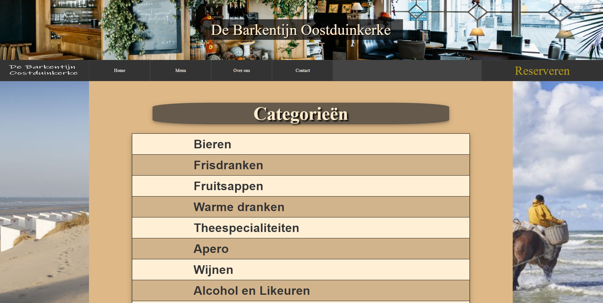
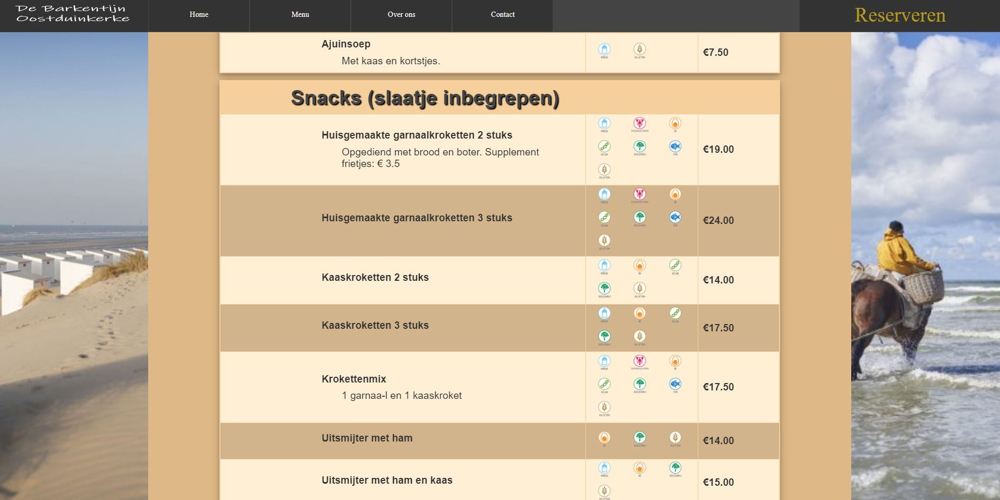
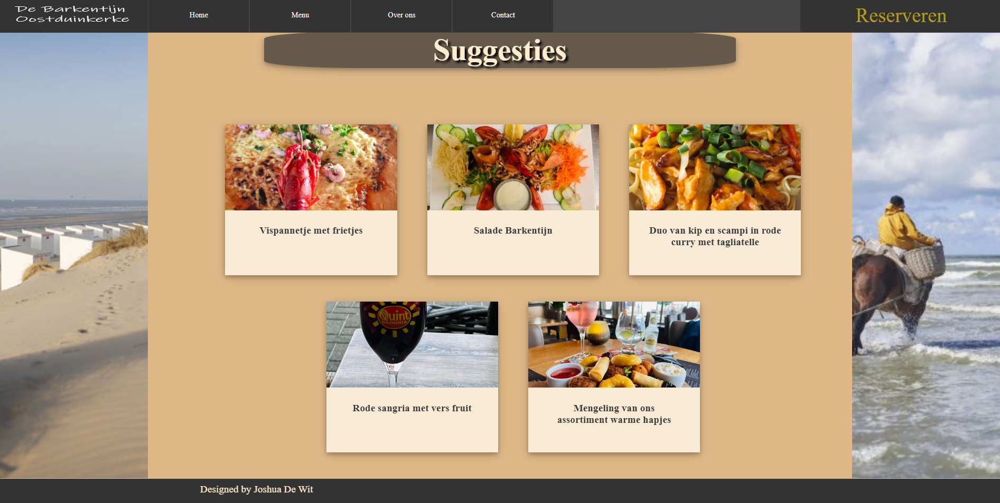
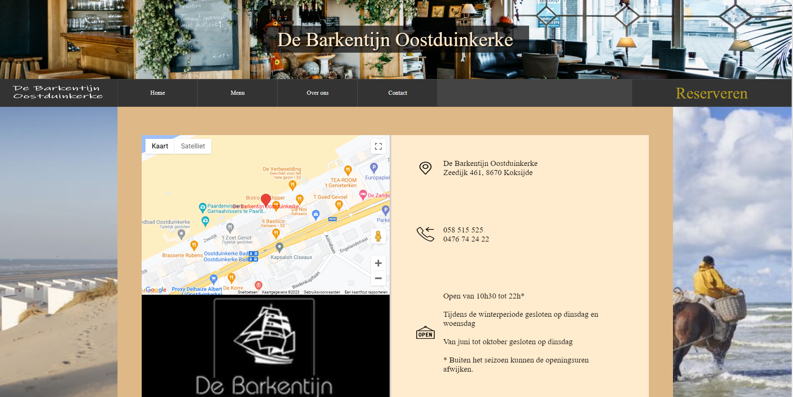
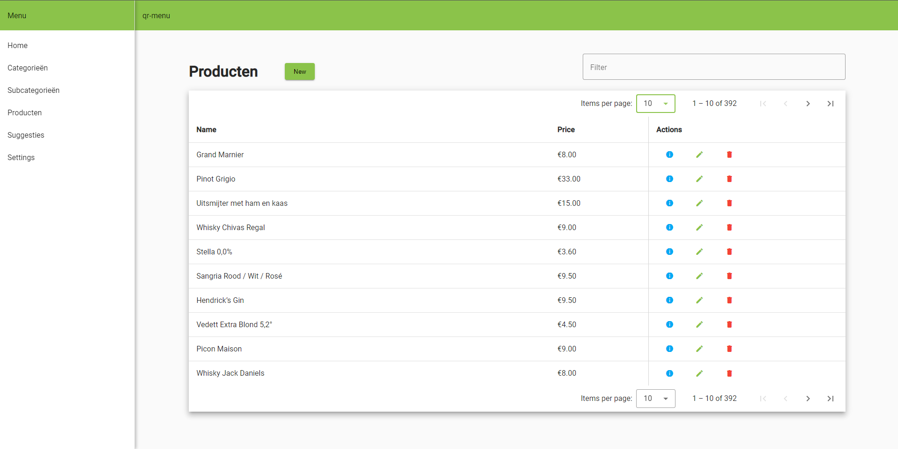
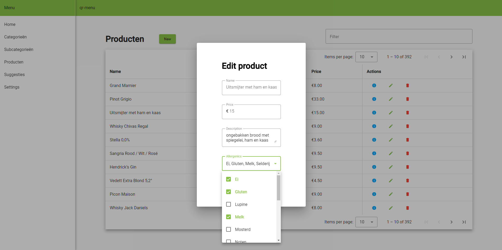

# qr-menu
A prototype of a single page web application designed for De Barkentijn Oostduinkerke.  
 

The Angular frontend consists of 
    <ul>
        <li>A simple public website designed for customers. Here they can view information about the business and browse the menu.</li>
        <li>A dashboard where the owner can interact with a GUI to manipulate the backend.</li>
    </ul>

The Spring Boot backend handles all HTTP requests to fetch data and manipulate a PostgreSQL database. With test-driven design in thought it contains many unit tests to guarantee correct functionality. 

All endpoints for CRUD operations are described by the [OpenAPI documentation](https://jaldwit.github.io/qr-menu/).  

Initial dummy data can be parsed from an excel file located in `backend\qr-menu\src\main\java\com\joshua\qrmenu\util` by sending
a GET request to the `/populate` endpoint.    

# Public frontend
## Menu page with a list of clickable categories.

## Category view with subcategories each containing products.
Each product has a name, description, price and a list of allergenics.  

## Suggested items

## Contact page with google map location displayed

# Dashboard
## Overview of all products in the database

## Editing a product

