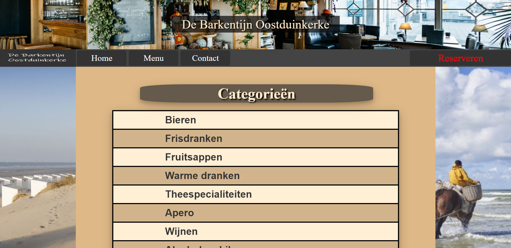
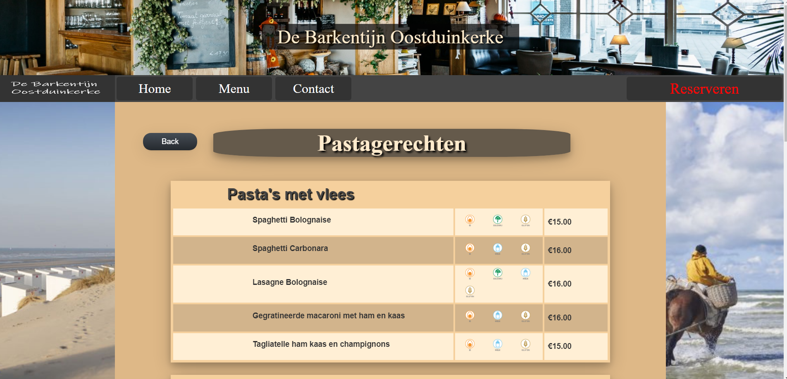

# qr-menu
A prototype of a QR menu app designed for De Barkentijn Oostduinkerke.  
Data can be parsed from an excel file located in `backend\qr-menu\src\main\java\com\joshua\qrmenu\util` by sending
a GET request to the `/populate` endpoint.  
Other endpoints are available as described by the [API documentation](https://jaldwit.github.io/qr-menu/).

## Home page of the menu with a list of clickable categories.

## Category view with subcategories each containing products.
Each product has a name, description, price and a list of allergenics.

